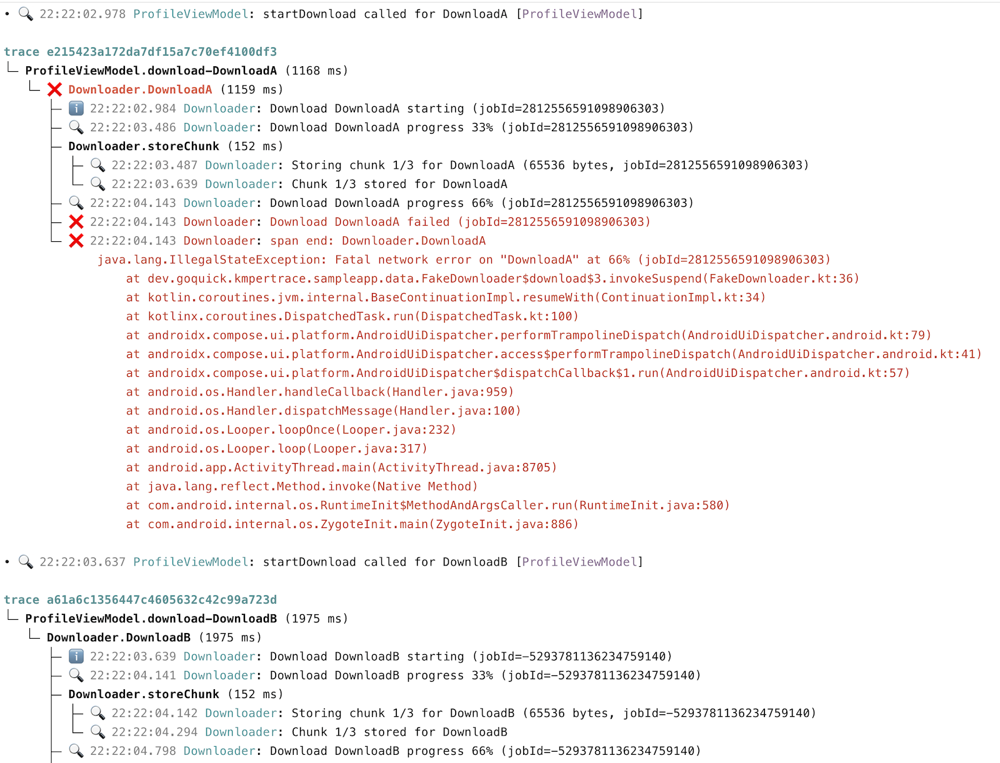

# KmperTrace

Span‑aware tracing and structured logging for Kotlin Multiplatform - with a CLI that turns raw logs
into readable trace trees.

When you're chasing a bug that hops across coroutines, threads, and platforms, plain logs are not
enough. KmperTrace lets you wrap important operations in spans, emit structured log lines with
trace/span IDs, and then reconstruct the full call tree from a single log file.



*Example: two overlapping downloads, nested repository/DB calls, and an injected failure - all
reconstructed from plain log output.*

---

## What KmperTrace gives you

- **End‑to‑end traces from just logs.**  
  No agents, no collectors: KmperTrace encodes `trace_id`/`span_id` and span events into log lines
  that can be shipped with whatever logging pipeline you already use.

- **Consistent tracing across KMP targets.**  
  One API that works on Android, iOS, JVM, and Wasm, with span/trace propagation that survives
  coroutine and thread hops.

- **Structured, low‑overhead logging.**  
  Logfmt‑compatible output that includes level, timestamp, trace/span IDs, source
  component/operation, and optional stack traces for errors.

- **Developer‑friendly tooling.**  
  A CLI (`kmpertrace-cli`) that can ingest a flat logfile and render readable trace trees, plus a
  sample Compose Multiplatform app that demonstrates end‑to‑end flow.

- **Pluggable backends.**  
  Platform‑native log sinks by default (Logcat, NSLog/`print`, stdout/console), with hooks to add
  your own `LogBackend` implementations.

---

## Modules

- `kmpertrace-runtime/`  
  Kotlin Multiplatform runtime with:
    - tracing API (`traceSpan`, `KmperTracer`),
    - structured logging (`Log`, components/operations),
    - platform‑specific glue to propagate trace context through coroutines and threads.

- `kmpertrace-cli/`  
  JVM CLI that:
    - reads structured KmperTrace log lines from a file or stdin,
    - groups them by `trace_id`,
    - reconstructs span trees, and
    - renders them as a readable text UI (as shown in the screenshot above).

---

## Quick Start

1. **Add the runtime dependency**

   In your KMP project, add `kmpertrace-runtime` to the source sets where you want tracing/logging:

   ```kotlin
   commonMain {
       dependencies {
           implementation("dev.goquick:kmpertrace-runtime:<version>")
       }
   }
   ```

2. **Configure KmperTrace at startup**

   Somewhere in your app initialization (per process):

   ```kotlin
   fun App() {
        LaunchedEffect(Unit) { 
            KmperTrace.configure(
                minLevel = Level.DEBUG,
                serviceName = "sample-app",
            )
        }
   }
   ```

3. **Wrap work in spans and log**

   ```kotlin
   suspend fun refreshAll() = traceSpan(component = "ProfileViewModel", operation = "refreshAll") {
       Log.i { "Refreshing profile..." }

       repository.loadProfile()
       repository.loadContacts()
       repository.loadActivity()

       Log.i { "Refresh complete" }
   }
   ```

   All logs inside `traceSpan { ... }` will carry `trace_id`/`span_id` so the CLI can reconstruct
   the tree.


4. **Run your app and collect logs for Android (non-interactive mode)**

   Run the app as usual; KmperTrace will emit structured log lines to the platform backend (Logcat,
   NSLog, stdout, etc.).

   To collect logs for already running app, launch:

   ```
   adb logcat --pid=$(adb shell pidof -s dev.goquick.kmpertrace.sampleapp) > /tmp/kmpertrace.log
   ```
   (change package to your app's package name)

   After that keep using the app to collect logs into a file. Press `Ctrl+C` to stop log collection.
   <br><br>
   **Or** (this is what I usually do) just copy/paste to file from Android Studio's Logcat view.


5. **Visualize with the CLI (non-interactive mode)**

   Clone the repo and build the binary for the CLI (need for both interactive and non-interactive
   modes):

   ```bash
   git clone https://github.com/mobiletoly/kmpertrace.git
   cd kmpertrace
   ./gradlew :kmpertrace-cli:installDist
   ```

   Run the CLI to visualize the logs from existing file (non-interactive print mode):

   ```bash
   ./kmpertrace-cli/build/install/kmpertrace-cli/bin/kmpertrace-cli print --file /path/to/your.log --color=on
   ```

   Or visualize logs in real-time from `adb logcat` (drop `adb logcat -c` if you don't want to clear
   the log buffer first):

   ```bash
   adb logcat -c && adb logcat -v epoch --pid="$(adb shell pidof dev.goquick.kmpertrace.sampleapp)" \
    | ./kmpertrace-cli/build/install/kmpertrace-cli/bin/kmpertrace-cli print --follow --color=on
   ```

   (replace `dev.goquick.kmpertrace.sampleapp` with your app's package name)

   You'll see per‑trace trees similar to the screenshot from the beginning of this README, with
   spans, durations, log lines, and error stack traces.

6. **Visualize with the CLI (interactive mode)**

   We have experimental interactive mode in kmpertrace-cli. E.g. to run it for adb events you can
   run:

   ```bash
   ./kmpertrace-cli/build/install/kmpertrace-cli/bin/kmpertrace-cli tui --source adb \
      --adb-pkg dev.goquick.kmpertrace.sampleapp
   ```

   or for iOS:

   ```bash
   ./kmpertrace-cli/build/install/kmpertrace-cli/bin/kmpertrace-cli tui --source ios \
      --ios-proc SampleApp
   ```

   This tool was tested on MacOS and Linux. Non-interactive print mode (or piping logs into tui
   --source stdin/file) should work on Windows. The interactive single-key raw mode doesn’t (Windows
   lacks the POSIX stty path), so Windows will fall back to the line-buffered input: type the letter
   and press Enter. ANSI styling works best in Windows Terminal/PowerShell with VT enabled (modern
   Windows does this by default); classic cmd.exe may look worse but still functions.

   See `docs/CLI-UserGuide.md` for current flags and interactive keys.

---

## Example: Logged Download Flow (Ktor)

Below is a code snippet that triggers a download when a button is pressed, fetches JSON
via Ktor, parses it, and logs each important step with KmperTrace.

```kotlin
@Serializable
data class Profile(val name: String, val downloads: Int)

@Composable
fun DownloadButton(client: HttpClient, url: String) {
    val scope = rememberCoroutineScope()
    Button(onClick = {
        scope.launch { downloadAndParse(client, url) }
    }) {
        Text("Download profile")
    }
}

private suspend fun downloadAndParse(client: HttpClient, url: String) =
    traceSpan(component = "Downloader", operation = "DownloadProfile") {
        val log = Log.forComponent("Downloader")
        log.i { "Button tapped: start download $url" }

        val bytes: ByteArray = traceSpan("FetchHttp") {
            log.i { "HTTP GET $url" }
            val b: ByteArray = client.get(url).body()
            log.d { "Fetched ${b.size} bytes" }
            b
        }

        val payload = traceSpan("ParseJson") {
            log.d { "Decoding JSON payload" }
            runCatching {
                Json.decodeFromString<Profile>(bytes.decodeToString())
            }.getOrElse { error ->
                log.e(error) { "Failed to decode profile" }
                throw error
            }
        }

        log.i { "Parsed profile name=${payload.name} downloads=${payload.downloads}" }
        payload
    }
```

Every log line inside `traceSpan` carries `trace_id`/`span_id`; the CLI can reconstruct the full
flow when you collect logs from your app.

Sample output from the CLI will look like this in case of success:

```
  trace 1234abcd...
  └─ Downloader.DownloadProfile (85 ms)
     ├─ ℹ️ 12:00:01.234 Downloader: Button tapped: start download https://api.example.com/profile.json
     ├─ Downloader.FetchHttp (42 ms)
     │  ├─ ℹ️ 12:00:01.235 Downloader: HTTP GET https://api.example.com/profile.json
     │  └─ 🔍 12:00:01.277 Downloader: Fetched 512 bytes
     ├─ Downloader.ParseJson (18 ms)
     │  └─ 🔍 12:00:01.295 Downloader: Decoding JSON payload
     └─ ℹ️ 12:00:01.303 Downloader: Parsed profile name=Alex downloads=42
```

or it will look like this in case of failure:

```
  trace 1234abcd...
  └─ Downloader.DownloadProfile (65 ms)
     ├─ ℹ️ 12:00:01.234 Downloader: Button tapped: start download https://api.example.com/profile.json
     ├─ Downloader.FetchHttp (40 ms)
     │  ├─ ℹ️ 12:00:01.235 Downloader: HTTP GET https://api.example.com/profile.json
     │  └─ 🔍 12:00:01.275 Downloader: Fetched 512 bytes
     └─ ❌ Downloader.ParseJson (23 ms)
        ├─ 🔍 12:00:01.295 Downloader: Decoding JSON payload
        └─ ❌ 12:00:01.318 Downloader: span end: Downloader.ParseJson
               java.lang.IllegalStateException: Failed to decode profile
                   at kotlinx.serialization.json.JsonDecoder....
                   at dev.goquick.kmpertrace.sampleapp.DownloadButtonKt.decodeProfile(DownloadButton.kt:42)
                   at dev.goquick.kmpertrace.sampleapp.DownloadButtonKt.downloadAndParse(DownloadButton.kt:32)
                   at ...
```

---

## Status

KmperTrace is early‑stage and APIs may change before `1.0`. Feedback, issues, and ideas for
integrations (backends, exporters, IDE plugins) are very welcome.
